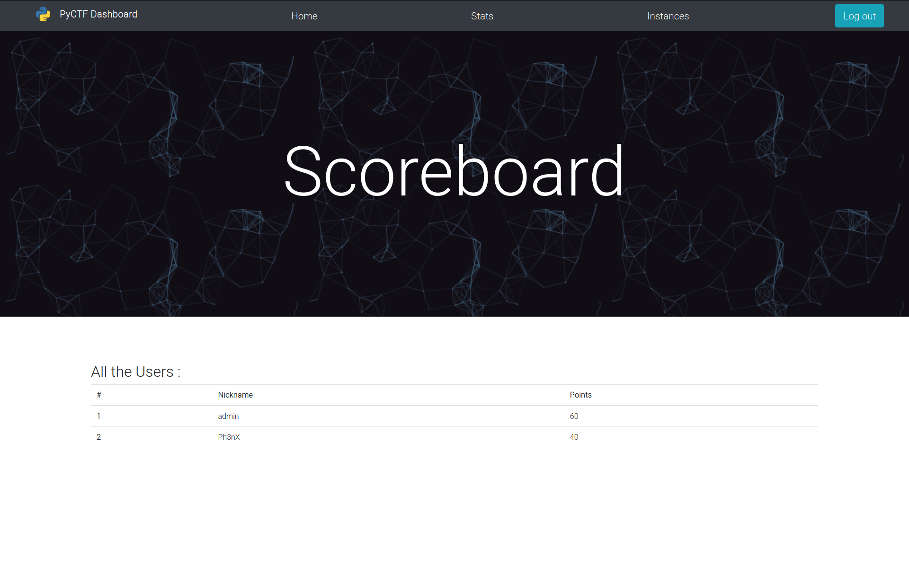
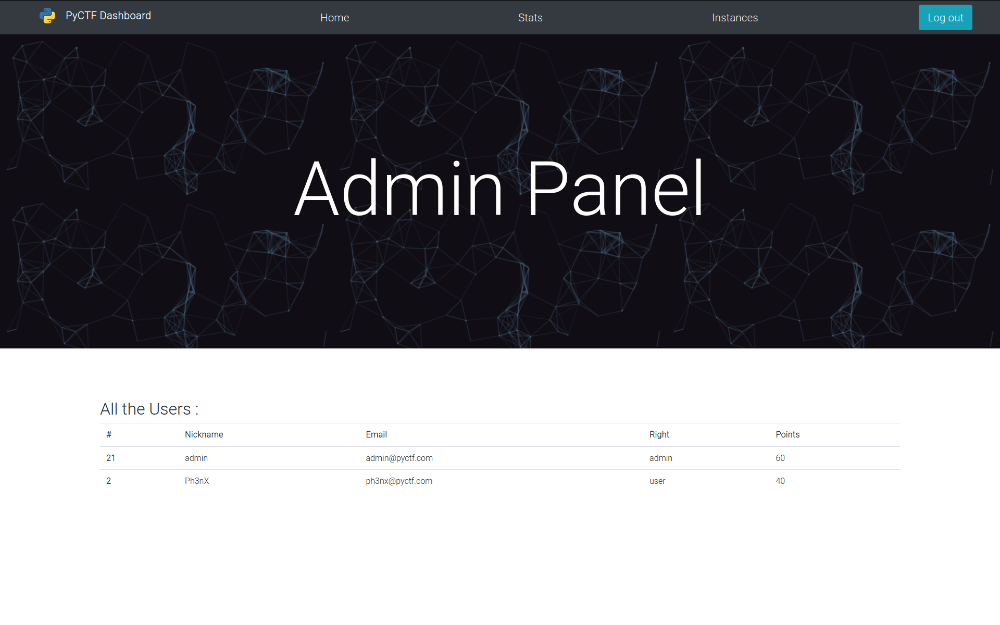

# PyCTF
Web Based CTF Platform, multithreaded and powered by python3

VERSION : Beta 1.0


## Presentation

PyCTF is a CTF platform that allows you to add challenges and deploy them dynamicaly. The storage of the personnal information are secured, such as the password, that are hashed with a complex algorithm (sha256, multi-round, with complex salt). This platform supports one or more users, and can be personalized (style and code).


## Usage

### Linux/Windows :

#### Install
```sh
git clone [url]
cd PyCTF
python3 main.py
```

#### Uninstall
```sh
rm -rf PyCTF
sudo docker system prune -a (Optional)
```

### Features to come :
* Global Chat
* Port representation (ranges and unique)
* Improve admin panel

### Features :
* Users management
* Instances Management
* Points and ranks system
* Scoreboard
* Login/logout and register panel
* Stats and personalized graphs
* User Friendly interface
* Automatic network configuration
* External access to docker network
* Optimisation of the website 
* Admin Panel

## Media


### Stats


### Scoreboard



### Instances


### Admin Panel



## Legal

Usefull Info:
* Informations are only stored in your computer.
* This project isn't GPDR compliant and must be used for personnal usage.

## Project Info

Back-End / Front-End / Code : [Ph3nX](https://github.com/Ph3nX-Z)

Report a Bug : [Report](https://github.com/Ph3nX-Z/PyCTF/blob/main/.github/ISSUE_TEMPLATE/bug_report.md)

## Supporters:
[](https://github.com/Ph3nX-Z/PyCTF/stargazers)

## Contributing

1. Fork it (<https://github.com/yourname/yourproject/fork>)
2. Create your feature branch (`git checkout -b feature/fooBar`)
3. Commit your changes (`git commit -am 'Add some fooBar'`)
4. Push to the branch (`git push origin feature/fooBar`)
5. Create a new Pull Request
